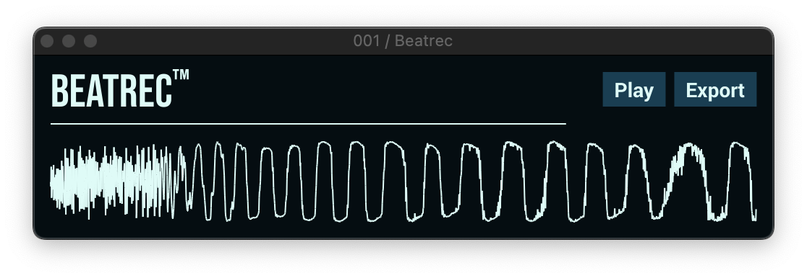

# Beatrec

Beatrec is an open source minimalistic rolling sampler, recording either a single beat or whatever range is set to loop in the DAW (assuming the DAW correctly passes this information on to the plug-in).

Find more information at (broken link, coming soon) [tphbrok.github.io/projects/beatrec](tphbrok.github.io/projects/beatrec)
